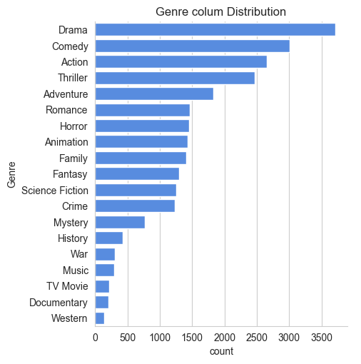
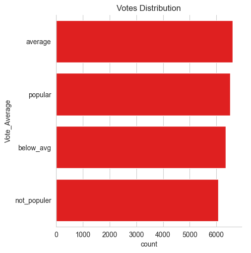
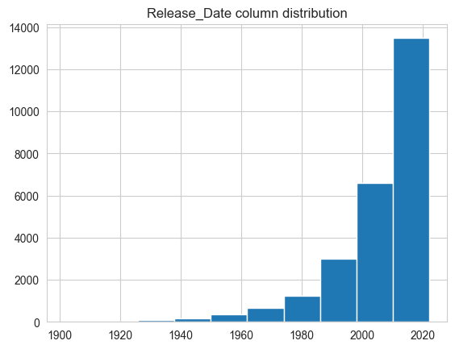

```python
# importing lib.
import pandas as pd
import numpy as np
import matplotlib.pyplot as plt
import seaborn as sns
```


```python
df = pd.read_csv('mymoviedb.csv', lineterminator = '\n')
```


```python
df.head()
```


<div>
<style scoped>
    .dataframe tbody tr th:only-of-type {
        vertical-align: middle;
    }

    .dataframe tbody tr th {
        vertical-align: top;
    }

    .dataframe thead th {
        text-align: right;
    }
</style>
<table border="1" class="dataframe">
  <thead>
    <tr style="text-align: right;">
      <th></th>
      <th>Release_Date</th>
      <th>Title</th>
      <th>Overview</th>
      <th>Popularity</th>
      <th>Vote_Count</th>
      <th>Vote_Average</th>
      <th>Original_Language</th>
      <th>Genre</th>
      <th>Poster_Url</th>
    </tr>
  </thead>
  <tbody>
    <tr>
      <th>0</th>
      <td>2021-12-15</td>
      <td>Spider-Man: No Way Home</td>
      <td>Peter Parker is unmasked and no longer able to...</td>
      <td>5083.954</td>
      <td>8940</td>
      <td>8.3</td>
      <td>en</td>
      <td>Action, Adventure, Science Fiction</td>
      <td>https://image.tmdb.org/t/p/original/1g0dhYtq4i...</td>
    </tr>
    <tr>
      <th>1</th>
      <td>2022-03-01</td>
      <td>The Batman</td>
      <td>In his second year of fighting crime, Batman u...</td>
      <td>3827.658</td>
      <td>1151</td>
      <td>8.1</td>
      <td>en</td>
      <td>Crime, Mystery, Thriller</td>
      <td>https://image.tmdb.org/t/p/original/74xTEgt7R3...</td>
    </tr>
    <tr>
      <th>2</th>
      <td>2022-02-25</td>
      <td>No Exit</td>
      <td>Stranded at a rest stop in the mountains durin...</td>
      <td>2618.087</td>
      <td>122</td>
      <td>6.3</td>
      <td>en</td>
      <td>Thriller</td>
      <td>https://image.tmdb.org/t/p/original/vDHsLnOWKl...</td>
    </tr>
    <tr>
      <th>3</th>
      <td>2021-11-24</td>
      <td>Encanto</td>
      <td>The tale of an extraordinary family, the Madri...</td>
      <td>2402.201</td>
      <td>5076</td>
      <td>7.7</td>
      <td>en</td>
      <td>Animation, Comedy, Family, Fantasy</td>
      <td>https://image.tmdb.org/t/p/original/4j0PNHkMr5...</td>
    </tr>
    <tr>
      <th>4</th>
      <td>2021-12-22</td>
      <td>The King's Man</td>
      <td>As a collection of history's worst tyrants and...</td>
      <td>1895.511</td>
      <td>1793</td>
      <td>7.0</td>
      <td>en</td>
      <td>Action, Adventure, Thriller, War</td>
      <td>https://image.tmdb.org/t/p/original/aq4Pwv5Xeu...</td>
    </tr>
  </tbody>
</table>
</div>


```python
# viewing dataset info
df.info()
```

    <class 'pandas.core.frame.DataFrame'>
    RangeIndex: 9827 entries, 0 to 9826
    Data columns (total 9 columns):
     #   Column             Non-Null Count  Dtype  
    ---  ------             --------------  -----  
     0   Release_Date       9827 non-null   object 
     1   Title              9827 non-null   object 
     2   Overview           9827 non-null   object 
     3   Popularity         9827 non-null   float64
     4   Vote_Count         9827 non-null   int64  
     5   Vote_Average       9827 non-null   float64
     6   Original_Language  9827 non-null   object 
     7   Genre              9827 non-null   object 
     8   Poster_Url         9827 non-null   object 
    dtypes: float64(2), int64(1), object(6)
    memory usage: 691.1+ KB
    


```python
# exploring genres column
df['Genre'].head()

```


    0    Action, Adventure, Science Fiction
    1              Crime, Mystery, Thriller
    2                              Thriller
    3    Animation, Comedy, Family, Fantasy
    4      Action, Adventure, Thriller, War
    Name: Genre, dtype: object


```python
# check for duplicated rows
df.duplicated().sum()
```


    np.int64(0)


```python
# exploring summary statistics
df.describe()
```


<div>
<style scoped>
    .dataframe tbody tr th:only-of-type {
        vertical-align: middle;
    }

    .dataframe tbody tr th {
        vertical-align: top;
    }

    .dataframe thead th {
        text-align: right;
    }
</style>
<table border="1" class="dataframe">
  <thead>
    <tr style="text-align: right;">
      <th></th>
      <th>Popularity</th>
      <th>Vote_Count</th>
      <th>Vote_Average</th>
    </tr>
  </thead>
  <tbody>
    <tr>
      <th>count</th>
      <td>9827.000000</td>
      <td>9827.000000</td>
      <td>9827.000000</td>
    </tr>
    <tr>
      <th>mean</th>
      <td>40.326088</td>
      <td>1392.805536</td>
      <td>6.439534</td>
    </tr>
    <tr>
      <th>std</th>
      <td>108.873998</td>
      <td>2611.206907</td>
      <td>1.129759</td>
    </tr>
    <tr>
      <th>min</th>
      <td>13.354000</td>
      <td>0.000000</td>
      <td>0.000000</td>
    </tr>
    <tr>
      <th>25%</th>
      <td>16.128500</td>
      <td>146.000000</td>
      <td>5.900000</td>
    </tr>
    <tr>
      <th>50%</th>
      <td>21.199000</td>
      <td>444.000000</td>
      <td>6.500000</td>
    </tr>
    <tr>
      <th>75%</th>
      <td>35.191500</td>
      <td>1376.000000</td>
      <td>7.100000</td>
    </tr>
    <tr>
      <th>max</th>
      <td>5083.954000</td>
      <td>31077.000000</td>
      <td>10.000000</td>
    </tr>
  </tbody>
</table>
</div>


* Exploration Summary

* we have a dataframe consisting of 9827 rows and 9 columns.
* Our dataset looks a bit tidy with no. Nans nor duplicated values.
* Release_Date column needs tobe casted into date-time and to extract only the yesr value.
* Overview, original_language and Poster_url wouldn't be to useful during analysis, so we'll drop them.
* there is noticable outliers in popularity column.
* Vote_Average better be categorised for proper analysis.
* Genre column has comma saperated values and with spaces that needs to be handled and casted into category.


```python
# casting column a
df['Release_Date'] = pd.to_datetime(df['Release_Date'])
# confirming changes
print(df['Release_Date'].dtypes)
```

    datetime64[ns]
    


```python
df['Release_Date'] = df['Release_Date'].dt.year
df['Release_Date'].dtypes
```


    dtype('int32')


```python
df.head()
```


<div>
<style scoped>
    .dataframe tbody tr th:only-of-type {
        vertical-align: middle;
    }

    .dataframe tbody tr th {
        vertical-align: top;
    }

    .dataframe thead th {
        text-align: right;
    }
</style>
<table border="1" class="dataframe">
  <thead>
    <tr style="text-align: right;">
      <th></th>
      <th>Release_Date</th>
      <th>Title</th>
      <th>Overview</th>
      <th>Popularity</th>
      <th>Vote_Count</th>
      <th>Vote_Average</th>
      <th>Original_Language</th>
      <th>Genre</th>
      <th>Poster_Url</th>
    </tr>
  </thead>
  <tbody>
    <tr>
      <th>0</th>
      <td>2021</td>
      <td>Spider-Man: No Way Home</td>
      <td>Peter Parker is unmasked and no longer able to...</td>
      <td>5083.954</td>
      <td>8940</td>
      <td>8.3</td>
      <td>en</td>
      <td>Action, Adventure, Science Fiction</td>
      <td>https://image.tmdb.org/t/p/original/1g0dhYtq4i...</td>
    </tr>
    <tr>
      <th>1</th>
      <td>2022</td>
      <td>The Batman</td>
      <td>In his second year of fighting crime, Batman u...</td>
      <td>3827.658</td>
      <td>1151</td>
      <td>8.1</td>
      <td>en</td>
      <td>Crime, Mystery, Thriller</td>
      <td>https://image.tmdb.org/t/p/original/74xTEgt7R3...</td>
    </tr>
    <tr>
      <th>2</th>
      <td>2022</td>
      <td>No Exit</td>
      <td>Stranded at a rest stop in the mountains durin...</td>
      <td>2618.087</td>
      <td>122</td>
      <td>6.3</td>
      <td>en</td>
      <td>Thriller</td>
      <td>https://image.tmdb.org/t/p/original/vDHsLnOWKl...</td>
    </tr>
    <tr>
      <th>3</th>
      <td>2021</td>
      <td>Encanto</td>
      <td>The tale of an extraordinary family, the Madri...</td>
      <td>2402.201</td>
      <td>5076</td>
      <td>7.7</td>
      <td>en</td>
      <td>Animation, Comedy, Family, Fantasy</td>
      <td>https://image.tmdb.org/t/p/original/4j0PNHkMr5...</td>
    </tr>
    <tr>
      <th>4</th>
      <td>2021</td>
      <td>The King's Man</td>
      <td>As a collection of history's worst tyrants and...</td>
      <td>1895.511</td>
      <td>1793</td>
      <td>7.0</td>
      <td>en</td>
      <td>Action, Adventure, Thriller, War</td>
      <td>https://image.tmdb.org/t/p/original/aq4Pwv5Xeu...</td>
    </tr>
  </tbody>
</table>
</div>


# Dropping the Columns.


```python
# making list of column to be dropped
cols = ['Overview', 'Original_Language', 'Poster_Url']
```


```python
 # dropping columns and confirming changes
df.drop(cols, axis = 1, inplace = True)
```


```python
df.columns
```


    Index(['Release_Date', 'Title', 'Popularity', 'Vote_Count', 'Vote_Average',
           'Genre'],
          dtype='object')


```python
df.head()
```


<div>
<style scoped>
    .dataframe tbody tr th:only-of-type {
        vertical-align: middle;
    }

    .dataframe tbody tr th {
        vertical-align: top;
    }

    .dataframe thead th {
        text-align: right;
    }
</style>
<table border="1" class="dataframe">
  <thead>
    <tr style="text-align: right;">
      <th></th>
      <th>Release_Date</th>
      <th>Title</th>
      <th>Popularity</th>
      <th>Vote_Count</th>
      <th>Vote_Average</th>
      <th>Genre</th>
    </tr>
  </thead>
  <tbody>
    <tr>
      <th>0</th>
      <td>2021</td>
      <td>Spider-Man: No Way Home</td>
      <td>5083.954</td>
      <td>8940</td>
      <td>8.3</td>
      <td>Action, Adventure, Science Fiction</td>
    </tr>
    <tr>
      <th>1</th>
      <td>2022</td>
      <td>The Batman</td>
      <td>3827.658</td>
      <td>1151</td>
      <td>8.1</td>
      <td>Crime, Mystery, Thriller</td>
    </tr>
    <tr>
      <th>2</th>
      <td>2022</td>
      <td>No Exit</td>
      <td>2618.087</td>
      <td>122</td>
      <td>6.3</td>
      <td>Thriller</td>
    </tr>
    <tr>
      <th>3</th>
      <td>2021</td>
      <td>Encanto</td>
      <td>2402.201</td>
      <td>5076</td>
      <td>7.7</td>
      <td>Animation, Comedy, Family, Fantasy</td>
    </tr>
    <tr>
      <th>4</th>
      <td>2021</td>
      <td>The King's Man</td>
      <td>1895.511</td>
      <td>1793</td>
      <td>7.0</td>
      <td>Action, Adventure, Thriller, War</td>
    </tr>
  </tbody>
</table>
</div>


**Categorizing Vote_Average column**

We would cut the Vote_Average values and make 4 categories popular, average, below_avg, not_populer to describe it more using catigorize_col() function provided above.


```python
def catigorize_col(df, col, labels):
 # catigorizes a certain column based on its quartiles
   
 #    Args:
 #        (df)     df   - dataframe we are proccesing
 #        (col)    str  - to be catigorized column's name 
 #        (labels) list - list of labels from min to max
    
 #    Returns:
 #        (df)     df   - dataframe with the categorized col
    
    # setting the edges to cut the column accordingly
    edges = [df[col].describe()['min'],
            df[col].describe()['25%'],
            df[col].describe()['50%'],
            df[col].describe()['75%'],
            df[col].describe()['max']]

    df[col] = pd.cut(df[col], edges, labels = labels, duplicates = 'drop')
    return df
```


```python
#  define labels for edges
labels = ['not_populer', 'below_avg', 'average', 'popular']
```


```python
# categorize column based on labels and edges
catigorize_col(df, 'Vote_Average', labels)
```


<div>
<style scoped>
    .dataframe tbody tr th:only-of-type {
        vertical-align: middle;
    }

    .dataframe tbody tr th {
        vertical-align: top;
    }

    .dataframe thead th {
        text-align: right;
    }
</style>
<table border="1" class="dataframe">
  <thead>
    <tr style="text-align: right;">
      <th></th>
      <th>Release_Date</th>
      <th>Title</th>
      <th>Popularity</th>
      <th>Vote_Count</th>
      <th>Vote_Average</th>
      <th>Genre</th>
    </tr>
  </thead>
  <tbody>
    <tr>
      <th>0</th>
      <td>2021</td>
      <td>Spider-Man: No Way Home</td>
      <td>5083.954</td>
      <td>8940</td>
      <td>popular</td>
      <td>Action, Adventure, Science Fiction</td>
    </tr>
    <tr>
      <th>1</th>
      <td>2022</td>
      <td>The Batman</td>
      <td>3827.658</td>
      <td>1151</td>
      <td>popular</td>
      <td>Crime, Mystery, Thriller</td>
    </tr>
    <tr>
      <th>2</th>
      <td>2022</td>
      <td>No Exit</td>
      <td>2618.087</td>
      <td>122</td>
      <td>below_avg</td>
      <td>Thriller</td>
    </tr>
    <tr>
      <th>3</th>
      <td>2021</td>
      <td>Encanto</td>
      <td>2402.201</td>
      <td>5076</td>
      <td>popular</td>
      <td>Animation, Comedy, Family, Fantasy</td>
    </tr>
    <tr>
      <th>4</th>
      <td>2021</td>
      <td>The King's Man</td>
      <td>1895.511</td>
      <td>1793</td>
      <td>average</td>
      <td>Action, Adventure, Thriller, War</td>
    </tr>
    <tr>
      <th>...</th>
      <td>...</td>
      <td>...</td>
      <td>...</td>
      <td>...</td>
      <td>...</td>
      <td>...</td>
    </tr>
    <tr>
      <th>9822</th>
      <td>1973</td>
      <td>Badlands</td>
      <td>13.357</td>
      <td>896</td>
      <td>popular</td>
      <td>Drama, Crime</td>
    </tr>
    <tr>
      <th>9823</th>
      <td>2020</td>
      <td>Violent Delights</td>
      <td>13.356</td>
      <td>8</td>
      <td>not_populer</td>
      <td>Horror</td>
    </tr>
    <tr>
      <th>9824</th>
      <td>2016</td>
      <td>The Offering</td>
      <td>13.355</td>
      <td>94</td>
      <td>not_populer</td>
      <td>Mystery, Thriller, Horror</td>
    </tr>
    <tr>
      <th>9825</th>
      <td>2021</td>
      <td>The United States vs. Billie Holiday</td>
      <td>13.354</td>
      <td>152</td>
      <td>average</td>
      <td>Music, Drama, History</td>
    </tr>
    <tr>
      <th>9826</th>
      <td>1984</td>
      <td>Threads</td>
      <td>13.354</td>
      <td>186</td>
      <td>popular</td>
      <td>War, Drama, Science Fiction</td>
    </tr>
  </tbody>
</table>
<p>9827 rows × 6 columns</p>
</div>


```python
# confirming changes
df['Vote_Average'].unique()
```


    ['popular', 'below_avg', 'average', 'not_populer', NaN]
    Categories (4, object): ['not_populer' < 'below_avg' < 'average' < 'popular']


```python
df.head()
```


<div>
<style scoped>
    .dataframe tbody tr th:only-of-type {
        vertical-align: middle;
    }

    .dataframe tbody tr th {
        vertical-align: top;
    }

    .dataframe thead th {
        text-align: right;
    }
</style>
<table border="1" class="dataframe">
  <thead>
    <tr style="text-align: right;">
      <th></th>
      <th>Release_Date</th>
      <th>Title</th>
      <th>Popularity</th>
      <th>Vote_Count</th>
      <th>Vote_Average</th>
      <th>Genre</th>
    </tr>
  </thead>
  <tbody>
    <tr>
      <th>0</th>
      <td>2021</td>
      <td>Spider-Man: No Way Home</td>
      <td>5083.954</td>
      <td>8940</td>
      <td>popular</td>
      <td>Action, Adventure, Science Fiction</td>
    </tr>
    <tr>
      <th>1</th>
      <td>2022</td>
      <td>The Batman</td>
      <td>3827.658</td>
      <td>1151</td>
      <td>popular</td>
      <td>Crime, Mystery, Thriller</td>
    </tr>
    <tr>
      <th>2</th>
      <td>2022</td>
      <td>No Exit</td>
      <td>2618.087</td>
      <td>122</td>
      <td>below_avg</td>
      <td>Thriller</td>
    </tr>
    <tr>
      <th>3</th>
      <td>2021</td>
      <td>Encanto</td>
      <td>2402.201</td>
      <td>5076</td>
      <td>popular</td>
      <td>Animation, Comedy, Family, Fantasy</td>
    </tr>
    <tr>
      <th>4</th>
      <td>2021</td>
      <td>The King's Man</td>
      <td>1895.511</td>
      <td>1793</td>
      <td>average</td>
      <td>Action, Adventure, Thriller, War</td>
    </tr>
  </tbody>
</table>
</div>


```python
df['Vote_Average'].value_counts()
```


    Vote_Average
    not_populer    2467
    popular        2450
    average        2412
    below_avg      2398
    Name: count, dtype: int64


```python
# dropping NANs
df.dropna(inplace = True)
# confirming
df.isna().sum()
```


    Release_Date    0
    Title           0
    Popularity      0
    Vote_Count      0
    Vote_Average    0
    Genre           0
    dtype: int64


```python
df.head()
```


<div>
<style scoped>
    .dataframe tbody tr th:only-of-type {
        vertical-align: middle;
    }

    .dataframe tbody tr th {
        vertical-align: top;
    }

    .dataframe thead th {
        text-align: right;
    }
</style>
<table border="1" class="dataframe">
  <thead>
    <tr style="text-align: right;">
      <th></th>
      <th>Release_Date</th>
      <th>Title</th>
      <th>Popularity</th>
      <th>Vote_Count</th>
      <th>Vote_Average</th>
      <th>Genre</th>
    </tr>
  </thead>
  <tbody>
    <tr>
      <th>0</th>
      <td>2021</td>
      <td>Spider-Man: No Way Home</td>
      <td>5083.954</td>
      <td>8940</td>
      <td>popular</td>
      <td>Action, Adventure, Science Fiction</td>
    </tr>
    <tr>
      <th>1</th>
      <td>2022</td>
      <td>The Batman</td>
      <td>3827.658</td>
      <td>1151</td>
      <td>popular</td>
      <td>Crime, Mystery, Thriller</td>
    </tr>
    <tr>
      <th>2</th>
      <td>2022</td>
      <td>No Exit</td>
      <td>2618.087</td>
      <td>122</td>
      <td>below_avg</td>
      <td>Thriller</td>
    </tr>
    <tr>
      <th>3</th>
      <td>2021</td>
      <td>Encanto</td>
      <td>2402.201</td>
      <td>5076</td>
      <td>popular</td>
      <td>Animation, Comedy, Family, Fantasy</td>
    </tr>
    <tr>
      <th>4</th>
      <td>2021</td>
      <td>The King's Man</td>
      <td>1895.511</td>
      <td>1793</td>
      <td>average</td>
      <td>Action, Adventure, Thriller, War</td>
    </tr>
  </tbody>
</table>
</div>


We'd split Genres into a list and then explode our dataframe to have only one Genre per row each movie


```python
# split the strings into lists
df['Genre'] = df['Genre'].str.split(', ')
```


```python
# explode the lists
df = df.explode('Genre').reset_index(drop = True)
```


```python
df.head()
```


<div>
<style scoped>
    .dataframe tbody tr th:only-of-type {
        vertical-align: middle;
    }

    .dataframe tbody tr th {
        vertical-align: top;
    }

    .dataframe thead th {
        text-align: right;
    }
</style>
<table border="1" class="dataframe">
  <thead>
    <tr style="text-align: right;">
      <th></th>
      <th>Release_Date</th>
      <th>Title</th>
      <th>Popularity</th>
      <th>Vote_Count</th>
      <th>Vote_Average</th>
      <th>Genre</th>
    </tr>
  </thead>
  <tbody>
    <tr>
      <th>0</th>
      <td>2021</td>
      <td>Spider-Man: No Way Home</td>
      <td>5083.954</td>
      <td>8940</td>
      <td>popular</td>
      <td>Action</td>
    </tr>
    <tr>
      <th>1</th>
      <td>2021</td>
      <td>Spider-Man: No Way Home</td>
      <td>5083.954</td>
      <td>8940</td>
      <td>popular</td>
      <td>Adventure</td>
    </tr>
    <tr>
      <th>2</th>
      <td>2021</td>
      <td>Spider-Man: No Way Home</td>
      <td>5083.954</td>
      <td>8940</td>
      <td>popular</td>
      <td>Science Fiction</td>
    </tr>
    <tr>
      <th>3</th>
      <td>2022</td>
      <td>The Batman</td>
      <td>3827.658</td>
      <td>1151</td>
      <td>popular</td>
      <td>Crime</td>
    </tr>
    <tr>
      <th>4</th>
      <td>2022</td>
      <td>The Batman</td>
      <td>3827.658</td>
      <td>1151</td>
      <td>popular</td>
      <td>Mystery</td>
    </tr>
  </tbody>
</table>
</div>


Casting column into category


```python
# casting column into category
df['Genre'] = df['Genre'].astype('category')
```


```python
# confirming changes
df['Genre'].dtypes
```


    CategoricalDtype(categories=['Action', 'Adventure', 'Animation', 'Comedy', 'Crime',
                      'Documentary', 'Drama', 'Family', 'Fantasy', 'History',
                      'Horror', 'Music', 'Mystery', 'Romance', 'Science Fiction',
                      'TV Movie', 'Thriller', 'War', 'Western'],
    , ordered=False, categories_dtype=object)


```python
df.info()
```

    <class 'pandas.core.frame.DataFrame'>
    RangeIndex: 25552 entries, 0 to 25551
    Data columns (total 6 columns):
     #   Column        Non-Null Count  Dtype   
    ---  ------        --------------  -----   
     0   Release_Date  25552 non-null  int32   
     1   Title         25552 non-null  object  
     2   Popularity    25552 non-null  float64 
     3   Vote_Count    25552 non-null  int64   
     4   Vote_Average  25552 non-null  category
     5   Genre         25552 non-null  category
    dtypes: category(2), float64(1), int32(1), int64(1), object(1)
    memory usage: 749.6+ KB
    


```python
df.nunique()
```


    Release_Date     100
    Title           9415
    Popularity      8088
    Vote_Count      3265
    Vote_Average       4
    Genre             19
    dtype: int64


* Now that our dataset is clean and tidy, we are left with a total of 6 columns and 25551 rows to dig into during our analysis


```python
df.head()
```


<div>
<style scoped>
    .dataframe tbody tr th:only-of-type {
        vertical-align: middle;
    }

    .dataframe tbody tr th {
        vertical-align: top;
    }

    .dataframe thead th {
        text-align: right;
    }
</style>
<table border="1" class="dataframe">
  <thead>
    <tr style="text-align: right;">
      <th></th>
      <th>Release_Date</th>
      <th>Title</th>
      <th>Popularity</th>
      <th>Vote_Count</th>
      <th>Vote_Average</th>
      <th>Genre</th>
    </tr>
  </thead>
  <tbody>
    <tr>
      <th>0</th>
      <td>2021</td>
      <td>Spider-Man: No Way Home</td>
      <td>5083.954</td>
      <td>8940</td>
      <td>popular</td>
      <td>Action</td>
    </tr>
    <tr>
      <th>1</th>
      <td>2021</td>
      <td>Spider-Man: No Way Home</td>
      <td>5083.954</td>
      <td>8940</td>
      <td>popular</td>
      <td>Adventure</td>
    </tr>
    <tr>
      <th>2</th>
      <td>2021</td>
      <td>Spider-Man: No Way Home</td>
      <td>5083.954</td>
      <td>8940</td>
      <td>popular</td>
      <td>Science Fiction</td>
    </tr>
    <tr>
      <th>3</th>
      <td>2022</td>
      <td>The Batman</td>
      <td>3827.658</td>
      <td>1151</td>
      <td>popular</td>
      <td>Crime</td>
    </tr>
    <tr>
      <th>4</th>
      <td>2022</td>
      <td>The Batman</td>
      <td>3827.658</td>
      <td>1151</td>
      <td>popular</td>
      <td>Mystery</td>
    </tr>
  </tbody>
</table>
</div>


# **Data Visualization**

Here, we'd use Matplotlib and seaborn for making some informative visuals to gain insights abut our data.


```python
 # setting up seaborn configurations
sns.set_style('whitegrid')
```

# What is the most frequent genre of movies released on Netflix?


```python
# showing stats. on genre column
df['Genre'].describe()
```


    count     25552
    unique       19
    top       Drama
    freq       3715
    Name: Genre, dtype: object


```python
# visualizing genre column
sns.catplot(y = 'Genre', data = df, kind = 'count', order = df['Genre'].value_counts().index, color = '#4287f5')
plt.title("Genre colum Distribution")
plt.show()
```


    

    


* we can notice from the above visual that Drama genre is the most frequent genre in our dataset and has appeared more than 14% of the times among 19 other genres.

# Which has highest votes in vote avg column?


```python
df.head()
```


<div>
<style scoped>
    .dataframe tbody tr th:only-of-type {
        vertical-align: middle;
    }

    .dataframe tbody tr th {
        vertical-align: top;
    }

    .dataframe thead th {
        text-align: right;
    }
</style>
<table border="1" class="dataframe">
  <thead>
    <tr style="text-align: right;">
      <th></th>
      <th>Release_Date</th>
      <th>Title</th>
      <th>Popularity</th>
      <th>Vote_Count</th>
      <th>Vote_Average</th>
      <th>Genre</th>
    </tr>
  </thead>
  <tbody>
    <tr>
      <th>0</th>
      <td>2021</td>
      <td>Spider-Man: No Way Home</td>
      <td>5083.954</td>
      <td>8940</td>
      <td>popular</td>
      <td>Action</td>
    </tr>
    <tr>
      <th>1</th>
      <td>2021</td>
      <td>Spider-Man: No Way Home</td>
      <td>5083.954</td>
      <td>8940</td>
      <td>popular</td>
      <td>Adventure</td>
    </tr>
    <tr>
      <th>2</th>
      <td>2021</td>
      <td>Spider-Man: No Way Home</td>
      <td>5083.954</td>
      <td>8940</td>
      <td>popular</td>
      <td>Science Fiction</td>
    </tr>
    <tr>
      <th>3</th>
      <td>2022</td>
      <td>The Batman</td>
      <td>3827.658</td>
      <td>1151</td>
      <td>popular</td>
      <td>Crime</td>
    </tr>
    <tr>
      <th>4</th>
      <td>2022</td>
      <td>The Batman</td>
      <td>3827.658</td>
      <td>1151</td>
      <td>popular</td>
      <td>Mystery</td>
    </tr>
  </tbody>
</table>
</div>


```python
# visualizing vote_average column
sns.catplot(y = 'Vote_Average', data = df, kind = 'count', order = df['Vote_Average'].value_counts().index, color = "red")
plt.title("Votes Distribution")
plt.show()
```


    

    


# What movie got the highest popularity? what's its genre?


```python
# checking max popularity in dataset
df[df['Popularity'] == df['Popularity'].max()]
```


<div>
<style scoped>
    .dataframe tbody tr th:only-of-type {
        vertical-align: middle;
    }

    .dataframe tbody tr th {
        vertical-align: top;
    }

    .dataframe thead th {
        text-align: right;
    }
</style>
<table border="1" class="dataframe">
  <thead>
    <tr style="text-align: right;">
      <th></th>
      <th>Release_Date</th>
      <th>Title</th>
      <th>Popularity</th>
      <th>Vote_Count</th>
      <th>Vote_Average</th>
      <th>Genre</th>
    </tr>
  </thead>
  <tbody>
    <tr>
      <th>0</th>
      <td>2021</td>
      <td>Spider-Man: No Way Home</td>
      <td>5083.954</td>
      <td>8940</td>
      <td>popular</td>
      <td>Action</td>
    </tr>
    <tr>
      <th>1</th>
      <td>2021</td>
      <td>Spider-Man: No Way Home</td>
      <td>5083.954</td>
      <td>8940</td>
      <td>popular</td>
      <td>Adventure</td>
    </tr>
    <tr>
      <th>2</th>
      <td>2021</td>
      <td>Spider-Man: No Way Home</td>
      <td>5083.954</td>
      <td>8940</td>
      <td>popular</td>
      <td>Science Fiction</td>
    </tr>
  </tbody>
</table>
</div>


# What movie got the lowest popularity? what's its genre?


```python
# checking min popularity in dataset
df[df['Popularity'] == df['Popularity'].min()]
```


<div>
<style scoped>
    .dataframe tbody tr th:only-of-type {
        vertical-align: middle;
    }

    .dataframe tbody tr th {
        vertical-align: top;
    }

    .dataframe thead th {
        text-align: right;
    }
</style>
<table border="1" class="dataframe">
  <thead>
    <tr style="text-align: right;">
      <th></th>
      <th>Release_Date</th>
      <th>Title</th>
      <th>Popularity</th>
      <th>Vote_Count</th>
      <th>Vote_Average</th>
      <th>Genre</th>
    </tr>
  </thead>
  <tbody>
    <tr>
      <th>25546</th>
      <td>2021</td>
      <td>The United States vs. Billie Holiday</td>
      <td>13.354</td>
      <td>152</td>
      <td>average</td>
      <td>Music</td>
    </tr>
    <tr>
      <th>25547</th>
      <td>2021</td>
      <td>The United States vs. Billie Holiday</td>
      <td>13.354</td>
      <td>152</td>
      <td>average</td>
      <td>Drama</td>
    </tr>
    <tr>
      <th>25548</th>
      <td>2021</td>
      <td>The United States vs. Billie Holiday</td>
      <td>13.354</td>
      <td>152</td>
      <td>average</td>
      <td>History</td>
    </tr>
    <tr>
      <th>25549</th>
      <td>1984</td>
      <td>Threads</td>
      <td>13.354</td>
      <td>186</td>
      <td>popular</td>
      <td>War</td>
    </tr>
    <tr>
      <th>25550</th>
      <td>1984</td>
      <td>Threads</td>
      <td>13.354</td>
      <td>186</td>
      <td>popular</td>
      <td>Drama</td>
    </tr>
    <tr>
      <th>25551</th>
      <td>1984</td>
      <td>Threads</td>
      <td>13.354</td>
      <td>186</td>
      <td>popular</td>
      <td>Science Fiction</td>
    </tr>
  </tbody>
</table>
</div>


#  Which year has the most filmmed movies?


```python
df['Release_Date'].hist()
plt.title('Release_Date column distribution')
plt.show()
```


    

    


```python

```
